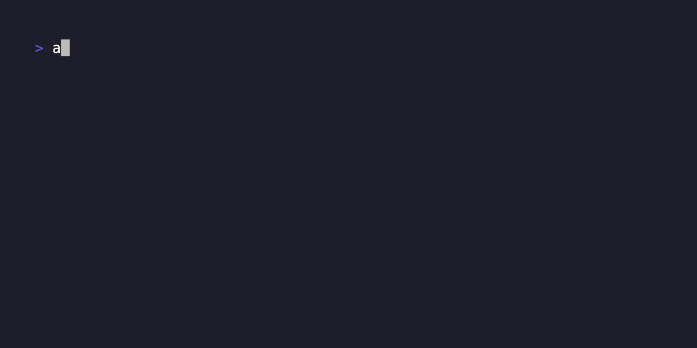
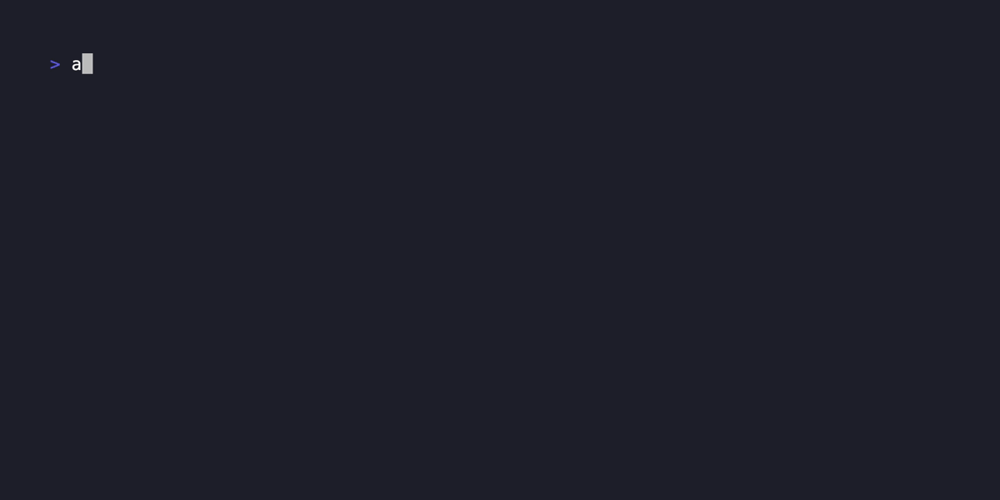

# assembllm

`assembllm` brings the power of LLM AIs to the command line with an extensible, WebAssembly-based plugin architecture.

- **LLM Chat Completions**: Supports building prompts piped from stdin and/or provided as an input argument.
- **Multi-AI Support**: Comes with built-in support for [OpenAI](https://platform.openai.com/docs/guides/text-generation/chat-completions-api), [Perplexity](https://docs.perplexity.ai/), and [Cloudflare](https://developers.cloudflare.com/workers-ai/models/#text-generation).
- **Plug-in Architecture**: Easily extend support for other LLMs. Plug-ins can be added via configuration without the need to recompile `assembllm`.
- **Cross-language support**: Create custom plugins in a variety of languages, including JavaScript, Rust, Go, C#, F#, AssemblyScript, Haskell, Zig, and C.

## Usage

```txt
$ assembllm -h
A WASM plug-in based CLI for AI chat completions

Usage:
  assembllm [prompt] [flags]

Flags:
  -p, --plugin string        The name of the plugin to use (default "openai")
  -m, --model string         The name of the model to use
  -c, --choose-model         Choose the model to use
  -t, --temperature string   The temperature to use
  -r, --role string          The role to use
      --raw                  Raw output without formatting
  -v, --version              Print the version
  -h, --help                 help for assembllm
```

Quickly get completion responses using default plug-in and model:


Select from a list of models supported by each plug-in:


Get real time information from Perplexity plug-in:



Build complex prompts by piping from stdin:


Role set the system prompt to influence the style and constraints of the prompt response:



## Installing

```bash
# install with Go
go install github.com/bradyjoslin/assembllm
```

## Plugins

Plug-ins are powered by [Extism](https://extism.org), a cross-language framework for building web-assembly based plug-in systems.

### Sample Plugins

Sample plugins are provided in the `/plugins` directory and show how to build plug-ins using Rust, TypeScript, Go, and C#.   These samples are also used in the default configuration.

### Plug-in Configuration

`assembllm` chat completion plugins are defined in `config.yaml` that is stored in `~/.assembllm`.  Each plugin is defined by:

- `name`: unique name for the plugin
- `source`: a reference to plug-in wasm file.  Can be a file path or http location.
- `hash`: sha 256-based hash of the wasm file for validation.  Optional, but recommended.
- `apiKey`: environment variable name containing the API Key for the plugin's service
- `accountId`: environment variable name containing the AccountID for the plugin's service.  Optional, used by some services like [Cloudflare](https://developers.cloudflare.com/workers-ai/get-started/rest-api/#1-get-api-token-and-account-id).
- `url`: the base url for the service used by the plug-in.  By default the plug-ins cannot make http calls, this grants access to the plug-in to call the API resource.
- `model`: default model to use. Optional.
- `wasi`: whether or not the plugin requires WASI

### Plug-in Architecture

`assembllm` acts as a [host application](https://extism.org/docs/concepts/host-sdk) that uses the Extism SDK to and is responsible for handling the user experience and interacting with the LLM chat completion plug-ins defined using Extism's [Plug-in Development Kits (PDKs)](https://extism.org/docs/concepts/pdk).

To be compatible with `assembllm`, each plugin must expose two functions via the PDK:

- **Models**: provides a list of models supported by the plug-in
- **Completion**: takes a string prompt and returns a completions response

### models Function

A `models` function should be exported by the plug-in and return an array of models supported by the LLM. Each object has the following properties:

- `name` (string): The name of the model.
- `aliases` (array): An array of strings, each string is an alias for the model.

Sample response:

```json
[
  {
    "name": "gpt-4o",
    "aliases": ["4o"]
  },
  {
    "name": "gpt-4",
    "aliases": ["4"]
  },
  {
    "name": "gpt-3.5",
    "aliases": ["35"]
  }
]
```

Here's a JSON Schema for the objects in the `models` array:

```json
{
  "$schema": "http://json-schema.org/draft-07/schema#",
  "type": "array",
  "items": {
    "type": "object",
    "properties": {
      "name": {
        "type": "string"
      },
      "aliases": {
        "type": "array",
        "items": {
          "type": "string"
        }
      }
    },
    "required": ["name", "aliases"]
  }
}
```

### completion Function

A `completion` function should be exported by the plug-in that takes the prompt and configuration as input and provides the chat completion response as output.

The plug-in is also provided configuration data from the `assembllm` host:

- `api_key`: user's API Key to use for the API service call
- `accountId`: Account ID for the plug-in service. Used by some services like [Cloudflare](https://developers.cloudflare.com/workers-ai/get-started/rest-api/#1-get-api-token-and-account-id).
- `model`: LLM model to use for completions response
- `temperature`: temperature value for the completion response
- `role`: prompt to use as the system message for the prompt

