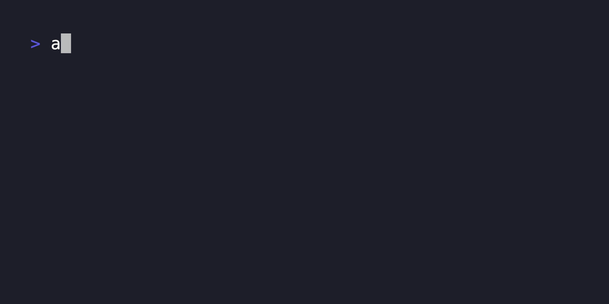

# assembllm

`assembllm` brings the power of LLM AIs to the command line with an extensible, WebAssembly-based plugin architecture.

- **LLM Chat Completions**: Supports building prompts piped from stdin and/or provided as an input argument.
- **Multi-AI Support**: Comes with built-in support for [OpenAI](https://platform.openai.com/docs/guides/text-generation/chat-completions-api), [Perplexity](https://docs.perplexity.ai/), and [Cloudflare AI](https://developers.cloudflare.com/workers-ai/models/#text-generation).
- **LLM Agent Chaining**: pass the output of one LLM as input to another, in a sequence or "pipeline", to perform complex tasks.
- **Plug-in Architecture**: Easily extend support for other LLMs. Plug-ins can be added via configuration without the need to recompile `assembllm`.
- **Cross-language support**: Create custom plugins in a variety of languages, including JavaScript, Rust, Go, C#, F#, AssemblyScript, Haskell, Zig, and C.

## Usage

```txt
$ assembllm -h
A WASM plug-in based CLI for AI chat completions

Usage:
  assembllm [prompt] [flags]
  assembllm [command]

Available Commands:
  tasks       LLM prompt chaining for complex tasks.

Flags:
  -p, --plugin string        The name of the plugin to use (default "openai")
  -m, --model string         The name of the model to use
  -c, --choose-model         Choose the model to use
  -t, --temperature string   The temperature to use
  -r, --role string          The role to use
      --raw                  Raw output without formatting
  -v, --version              Print the version
  -h, --help                 help for assembllm

Use "assembllm [command] --help" for more information about a command.
```

Quickly get completion responses using default plug-in and model:


Select from a list of models supported by each plug-in:



Build complex prompts by piping from stdin:


Combine multiple agents for enhanced results. In this example, first generate a topic, then conduct research and analysis, and finally compose a blog post. 

```yaml
# ./llm_chaining/research_example_task.yaml
tasks:
  - name: topic
    plugin: perplexity
    prompt: "ten bullets summarizing extism plug-in systems with wasm"
  - name: researcher
    plugin: openai
    role: "you are a technical research assistant"
    prompt: "ten bullets summarizing extism plug-in systems with wasm"
  - name: writer
    plugin: openai
    role: "you are a technical writer"
    prompt: "write a blog post on the provided research, avoid bullets, use prose and include section headers"
    temperature: 0.5
    model: 4o
```

Then execute the tasks by using the `tasks` command:

```sh
 assembllm tasks ./llm_chaining/research_example_task.yaml
```

Alternatively, you can chain LLM responses using bash scripts:

```sh
#!/bin/bash

TOPIC="ten bullets summarizing extism plug-in systems with wasm"
RESEARCHER="you are a technical research assistant"
ANALYSIS="analyze these capabilities against the broader backdrop of webassembly."
WRITER="you are a technical writer specializing in trends, skilled at helping developers understand the practical use of new technology described from first principles"
BLOG_POST="write a blog post on the provided research, avoid bullets, use prose and include section headers"

assembllm -p perplexity "$TOPIC" \
| assembllm -r "$RESEARCHER" "$ANALYSIS" \
| assembllm --raw -r "$WRITER" "$BLOG_POST" \
| tee research_example_output.md
```

Sample output running this example can be found [here](https://github.com/bradyjoslin/assembllm/blob/main/llm_chaining/research_example_output.md).

## Installing

```bash
# install with brew
brew tap bradyjoslin/assembllm
brew install bradyjoslin/assembllm/assembllm

# install with Go
go install github.com/bradyjoslin/assembllm
```

Or grab a pre-built binary from [releases](https://github.com/bradyjoslin/assembllm/releases).

## Plugins

Plug-ins are powered by [Extism](https://extism.org), a cross-language framework for building web-assembly based plug-in systems.  `assembllm` acts as a [host application](https://extism.org/docs/concepts/host-sdk) that uses the Extism SDK to and is responsible for handling the user experience and interacting with the LLM chat completion plug-ins which use Extism's [Plug-in Development Kits (PDKs)](https://extism.org/docs/concepts/pdk).

### Sample Plugins

Sample plugins are provided in the `/plugins` directory implemented using Rust, TypeScript, Go, and C#.   These samples are implemented in the default configuration on install.

### Plug-in Configuration

`assembllm` chat completion plugins are defined in `config.yaml` that is stored in `~/.assembllm`.  The first plug-in in the configuration file will be used as the default.

The provided plug-in configuration is used to define an [Extism manifest](https://extism.org/docs/concepts/manifest/) that `assembllm` uses to load the Wasm module, grant it the relevant permissions, and provide configuration data.  Wasm is sandboxed by default, unable to access the filesystem, make network calls, or access system information like environment variables unless explicitly granted by the host.

Let's walk through a sample configuration as defined below. We're importing a plug-in named `openai` whose Wasm source is loaded from a remote URL.  A hash is provided to confirm the integrity of the Wasm source. The `apiKey` for the plug-in will be loaded from an environment variable named `OPENAI_API_KEY` and passed as a configuration value to the plug-in.  The base URL the plug-in will use to make API calls to the OpenAI API is provided, granting the plug-in permission to call that resource as an allowed host.  Lastly, we set a default model, which is passed as a configuration value to the plug-in.  

```yml
completion-plugins:
  - name: openai
    source: https://cdn.modsurfer.dylibso.com/api/v1/module/114e1e892c43baefb4d50cc8b0e9f66df2b2e3177de9293ffdd83898c77e04c7.wasm
    hash: 114e1e892c43baefb4d50cc8b0e9f66df2b2e3177de9293ffdd83898c77e04c7
    apiKey: OPENAI_API_KEY
    url: api.openai.com
    model: 4o
...
```

Here is the full list of available plug-in configuration values:

- `name`: unique name for the plugin.
- `source`: wasm file location, can be a file path or http location.
- `hash`: sha 256-based hash of the wasm file for validation.  Optional, but recommended.
- `apiKey`: environment variable name containing the API Key for the service the plug-in uses
- `accountId`: environment variable name containing the AccountID for the plugin's service.  Optional, used by some services like [Cloudflare](https://developers.cloudflare.com/workers-ai/get-started/rest-api/#1-get-api-token-and-account-id).
- `url`: the base url for the service used by the plug-in. 
- `model`: default model to use.
- `wasi`: whether or not the plugin requires WASI.

### Plug-in Architecture

To be compatible with `assembllm`, each plugin must expose two functions via the PDK:

- **Models**: provides a list of models supported by the plug-in
- **Completion**: takes a string prompt and returns a completions response

### models Function

A `models` function should be exported by the plug-in and return an array of models supported by the LLM. Each object has the following properties:

- `name` (string): The name of the model.
- `aliases` (array): An array of strings, each string is an alias for the model.

Sample response:

```json
[
  {
    "name": "gpt-4o",
    "aliases": ["4o"]
  },
  {
    "name": "gpt-4",
    "aliases": ["4"]
  },
  {
    "name": "gpt-3.5",
    "aliases": ["35"]
  }
]
```

Here's a JSON Schema for the objects in the `models` array:

```json
{
  "$schema": "http://json-schema.org/draft-07/schema#",
  "type": "array",
  "items": {
    "type": "object",
    "properties": {
      "name": {
        "type": "string"
      },
      "aliases": {
        "type": "array",
        "items": {
          "type": "string"
        }
      }
    },
    "required": ["name", "aliases"]
  }
}
```

### completion Function

A `completion` function should be exported by the plug-in that takes the prompt and configuration as input and provides the chat completion response as output.

The plug-in is also provided configuration data from the `assembllm` host:

- `api_key`: user's API Key to use for the API service call
- `accountId`: Account ID for the plug-in service. Used by some services like [Cloudflare](https://developers.cloudflare.com/workers-ai/get-started/rest-api/#1-get-api-token-and-account-id).
- `model`: LLM model to use for completions response
- `temperature`: temperature value for the completion response
- `role`: prompt to use as the system message for the prompt
